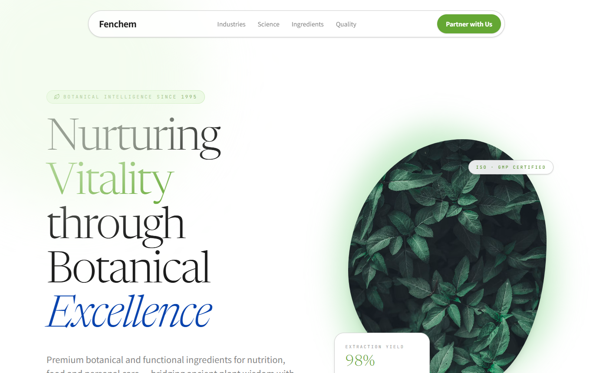
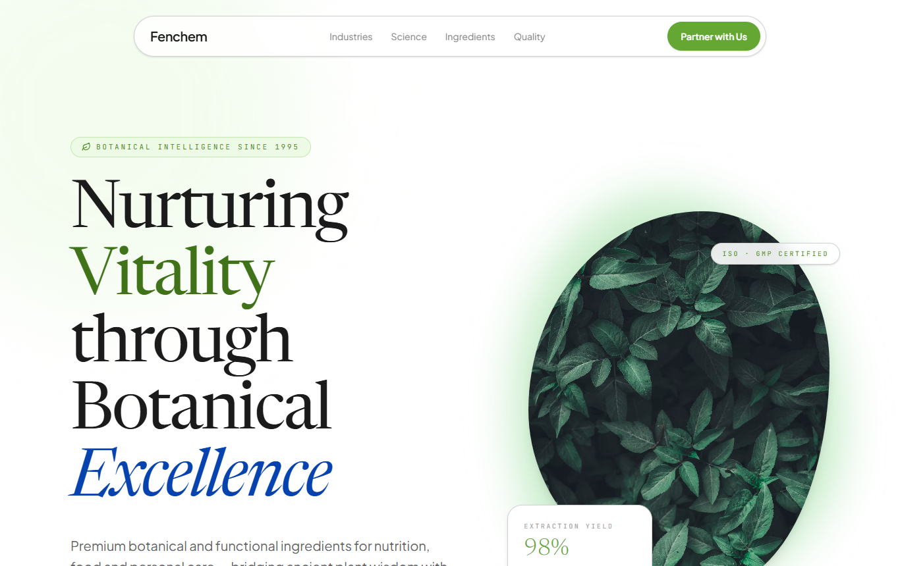
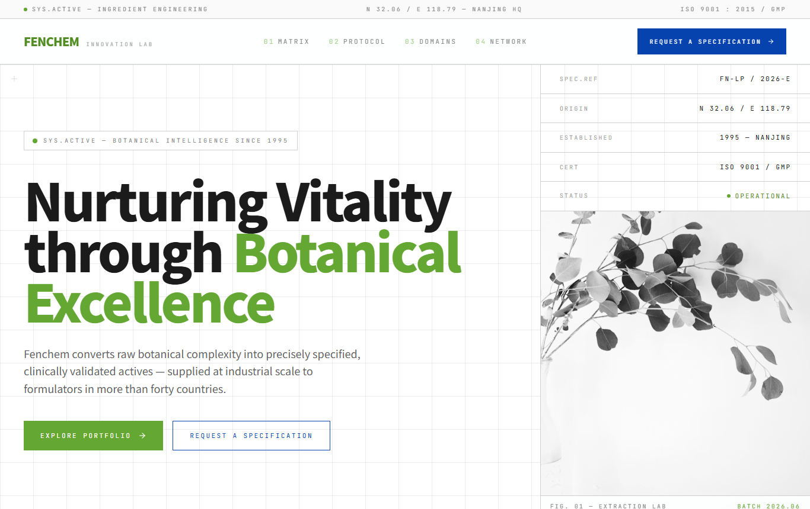
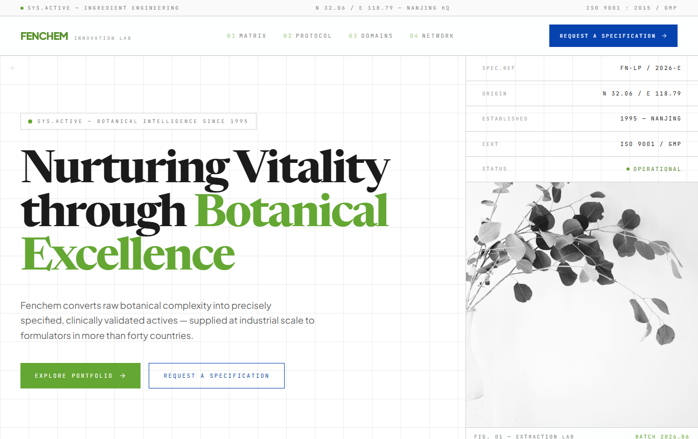
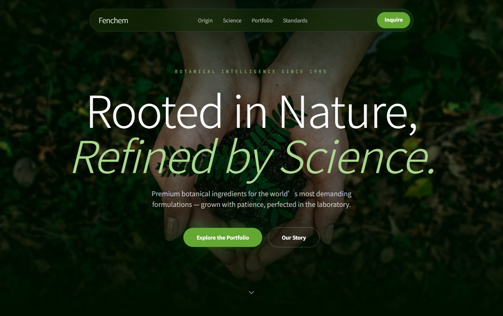
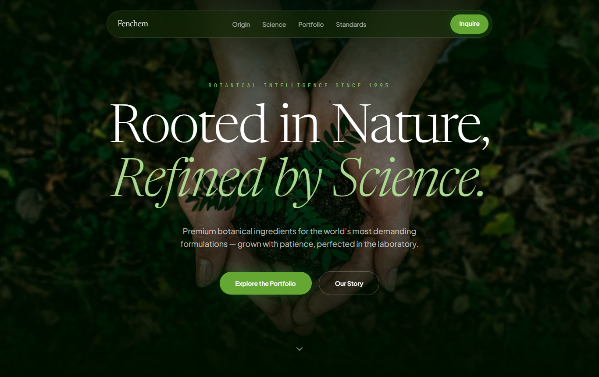

# Font comparison — D / E / F: 思源黑体 (before) vs current (after)

_Date: 2026-06-15. A visual before/after of the brand variants' typography._
_Decision + measured rationale: [font-adoption-comparison.md](./font-adoption-comparison.md) · [ADR-0002](../adr/0002-english-site-typography.md)._

## What's being compared

- **Before — Source Han Sans (思源黑体 / Noto Sans SC)**: the brand-book typeface, captured
  from tag `brand-variants-v1-sourcehan` (commit `52ead35`).
- **After — current**: **Newsreader** (serif display) + **Plus Jakarta Sans** (body/UI) +
  **JetBrains Mono** (labels), captured from `HEAD`.

Screenshots are real captures at 1366×860 (reduced-motion), saved under
`docs/brand/screenshots/font-{before,after}-{d,e,f}.png`.

> **Honest caveats.**
> • **D** was always the "editorial" variant, so its *headline* is Newsreader serif in **both**
>   shots — D's change is the **body** font (Noto → Plus Jakarta) **plus** the hero contrast
>   fix (commit `78811c8`), so its "after" is crisper for more than one reason.
> • **E** and **F** are the clean *font-only* comparisons — their headlines flipped from
>   Source Han Sans (sans) to Newsreader (serif).

---

## D — Botanical Editorial

| Before · Source Han Sans body | After · Plus Jakarta body + contrast fix |
|---|---|
|  |  |

The serif headline is unchanged. In the **after**, the lede/body switches to Plus Jakarta
(cleaner, less generic than Noto's Latin) and the headline reads darker and more solid (the
green veil no longer washes it, weight 300→400, accent green-500→green-700). **After wins.**

## E — Innovation Lab

| Before · Source Han Sans headline | After · Newsreader serif headline |
|---|---|
|  |  |

The clearest swap. **Before** is a heavy Source Han Sans headline — which actually *suits*
the Swiss / spec-sheet genre, but its Latin letterforms are generic. **After** is an elegant
Newsreader serif, more premium but less "laboratory." **Judgment call:** the serif reads
better as craft, yet E's Swiss identity might be served best by a **dedicated grotesque sans**
(not Source Han) for the headline. See recommendation. *(Body + mono labels improve in both.)*

## F — Deep Green

| Before · Source Han Sans headline | After · Newsreader serif headline |
|---|---|
|  |  |

Decisive. **Before** is a plain sans on the dark hero; **after** is Newsreader with an italic
"*Refined by Science.*" — exactly the luxury-flagship register this variant wants. **After
wins clearly.**

---

## Verdict

| Variant | Better setting | Why |
|---|---|---|
| **D** | **After** (current) | Cleaner body font + the hero contrast fix; headline serif unchanged. |
| **E** | **After**, with an asterisk | Serif is more elegant; but a clean grotesque sans would suit the Swiss/lab look even better than either Source Han **or** serif. |
| **F** | **After** (current) | Serif italic is perfect for the dark luxury flagship; Source Han looked generic. |

**Overall:** the current pairing (Newsreader + Plus Jakarta + JetBrains Mono) is the stronger,
more premium choice for the **English** site across all three — the win is largest on F and on
**body text everywhere** (Plus Jakarta vs Noto's CJK-harmonized Latin). Source Han Sans remains
correct for **Chinese** materials (kept as a local CJK fallback).

## Open recommendation (E only)

If E (Innovation Lab) should feel more like a Swiss spec-sheet, try its **headline in Plus
Jakarta Sans (or a dedicated grotesque), not the serif** — keeping the serif for D/F. That
gives each variant the type personality its layout wants. Say the word and I'll prototype it.
